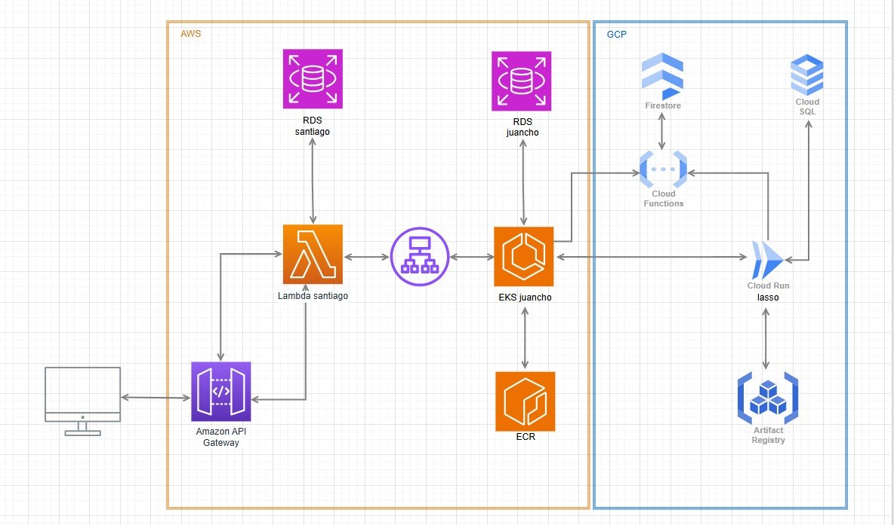

<p align="center">
  <a href="http://nestjs.com/" target="blank">
    
  </a>
</p>

<h1 align="center">Vet DevOps System</h1>

<p align="center">
RESTful API for veterinary management built with <b>NestJS</b>, <b>PostgreSQL</b>, and modern <b>DevOps practices</b> including Docker, CI/CD pipelines, automated testing, staging and production environments.
</p>

---

# Project Overview

This project implements a **Veterinary Management API** that allows managing:

- Owners
- Pets
- Appointments

The system demonstrates **DevOps practices**, including:

- Containerization with **Docker**
- **CI/CD pipelines** with GitHub Actions
- **Staging and Production environments**
- Automated testing and **coverage gates**
- Automated deployment with **Render**
- Cloud database using **Supabase**

---

# Architecture

Main technologies used:

| Technology | Purpose |
|---|---|
| NestJS | Backend framework |
| PostgreSQL | Relational database |
| TypeORM | ORM |
| Docker | Containerization |
| GitHub Actions | CI/CD |
| Render | Deployment |
| Supabase | Managed PostgreSQL |
| Swagger | API documentation |
| Jest | Testing framework |

---

# Entities

The API manages three main resources.

## Owners

Represents a pet owner.

Example fields:
id
name
email
iphone

---

## Pets

Represents a pet belonging to an owner.

id
name
species
breed
birthDate
ownerId

Relationship:
Owner -> many Pets

---

## Appointments

Represents veterinary appointments.

id
petId
appointmentDate
reason
status

Relationship:
Pet -> many Appointments

---

# API Documentation

Swagger documentation is available at:
/api#

Example staging URL:
https://vet-devops-system.onrender.com/api#

Swagger allows:

- Testing endpoints
- Viewing request schemas
- Viewing responses
- Understanding API structure

---

# Running the Project Locally

## Install dependencies

```bash
npm install
```

## Run in development mode
```bash
npm run start:dev
```
## Build the project
```bash
npm run start:prod
```

# Running with docker
The project includes Docker support for running the entire stack

## Build and start containers
```bash
docker compose up --build
```

This will start:
- API Container
- PostgreSQL container

Containers will run on:
API -> localhost:3000
PostgreSQL -> localhost:5433

# Testing
The project includes unit tests for service and controllers

Run unit test:
```bash
npm run test
```

Run tests with coverage:
```bash
npm run test -- --coverage
```

Coverage reports are generated automatically in the /coverage directory.

# CI/CD Pipelines
The project uses Github Actions to automate testing and deployment.
Two pipelines are configured.

## Staging pipeline
Triggered when pushing to develop branch
Pipeline steps:

Install dependencies

Run tests

Generate coverage

Validate coverage ≥ 60%

Build the project

Deploy automatically to Render Staging

This environment is used for testing new changes before production.

## Production pipeline
Triggered when pushing to main branch
Pipeline steps:

Install dependencies

Run tests

Generate coverage

Validate coverage ≥ 85%

Build the project

Deploy automatically to Render Production

Production requires stricter quality control.

If tests fail or coverage is below the threshold, deployment is blocked.


### Architecture Diagram


---

# Canary Deployment Strategy

## What is Canary?
A deployment strategy that releases a new version to a small percentage of users before full rollout. If the new version fails, only that percentage is affected.

## Architecture

```
User
   ↓
AWS Network Load Balancer
   ↓
Nginx Ingress Controller
   ↓              ↓
90% traffic    10% traffic
   ↓              ↓
vet-stable-    vet-canary-
service        service
   ↓              ↓
2 pods         1 pod
stable         canary
   ↓              ↓
      RDS PostgreSQL
```

## Kubernetes Components

| File | Description |
|---|---|
| `k8s/deployment-stable.yaml` | 2 replicas with `devops:stable` image |
| `k8s/deployment-canary.yaml` | 1 replica with `devops:canary` image |
| `k8s/service.yaml` | `vet-stable-service` and `vet-canary-service` |
| `k8s/ingress.yaml` | Nginx Ingress — 90% stable / 10% canary |

## Traffic Control
Nginx Ingress Controller distributes traffic using annotations:
```yaml
nginx.ingress.kubernetes.io/canary: "true"
nginx.ingress.kubernetes.io/canary-weight: "10"
```

---

## Validation URLs

Base URL:
```
http://a461d5a1902a04ef2aacece9f16cd4fd-9d0ea69ab7913be1.elb.us-east-2.amazonaws.com
```

### Stable HealthCheck
```
GET /api/v2/health
```
Expected response:
```json
{
  "status": "stable",
  "version": "2.0.0",
  "uptime": 1234,
  "timestamp": "2026-06-02T..."
}
```

### Canary HealthCheck
~10% of requests will respond:
```json
{
  "status": "canary",
  "version": "2.1.0",
  "deploymentDate": "2026-06-02",
  "timestamp": "2026-06-02T..."
}
```

### Swagger UI
```
GET /api
```

### Validate traffic distribution with Postman
Send 10 requests to `/api/v2/health` — approximately 9 will respond `stable` and 1 will respond `canary`.

---

## Monitoring

### View running pods
```bash
kubectl get pods --show-labels
```

### View deployments status
```bash
kubectl get deployments
```

### View ingress configuration
```bash
kubectl describe ingress vet-app-ingress
kubectl describe ingress vet-app-ingress-canary
```

### View Nginx logs (traffic distribution)
```bash
kubectl logs -n ingress-nginx deployment/ingress-nginx-controller | grep "api/v2/health"
```
